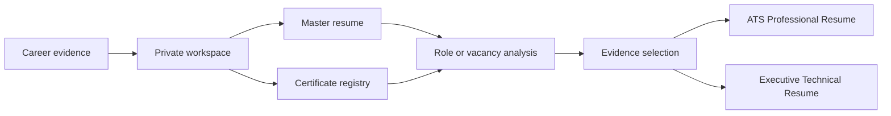

# Career Evidence Toolkit

<p align="center">
  
</p>

<p align="center">
  <strong>Maintain verified career evidence. Generate truthful, role-specific resumes.</strong>
</p>

<p align="center">
  Open-source agent skills for building a durable career source of truth, reconciling professional credentials, and producing ATS-safe or executive resumes without inventing claims.
</p>

<p align="center">
  <a href="https://github.com/haziqmalik/career-evidence-toolkit/actions/workflows/validate.yml"></a>
  <a href="https://github.com/haziqmalik/career-evidence-toolkit/releases/latest"></a>
  <a href="LICENSE"></a>
  <a href="https://github.com/haziqmalik/career-evidence-toolkit/stargazers"></a>
  <a href="https://github.com/haziqmalik/career-evidence-toolkit/commits/main"></a>
  <a href="https://chatgpt.com/plugins/plugins_6aa9bad6fb0c8191a2bcbaa46e45a59e"></a>
  <a href="https://haziqmalik.github.io/career-evidence-toolkit/"></a>
</p>

<p align="center">
  <a href="https://chatgpt.com/plugins/plugins_6aa9bad6fb0c8191a2bcbaa46e45a59e"><strong>Install in ChatGPT</strong></a>
  ·
  <a href="https://haziqmalik.github.io/career-evidence-toolkit/"><strong>Website</strong></a>
  ·
  <a href="https://github.com/haziqmalik/career-evidence-toolkit/wiki"><strong>Wiki</strong></a>
  ·
  <a href="ROADMAP.md"><strong>Roadmap</strong></a>
  ·
  <a href="CONTRIBUTING.md"><strong>Contribute</strong></a>
</p>

---

## Why this exists

Most AI-assisted resume workflows begin with whatever context happens to be available in the current conversation. That makes it easy for career history to drift, credentials to become inconsistent, or role-specific resumes to contain claims that were never properly evidenced.

Career Evidence Toolkit takes the opposite approach:

1. establish a private, durable career workspace;
2. maintain a comprehensive master resume as the source of truth;
3. reconcile certificate and credential evidence;
4. analyze the target role;
5. select only relevant, supported evidence; and
6. render the result into an ATS-safe or executive resume format.

The goal is not to generate more resume text. The goal is to make career documents **repeatable, evidence-aware, and maintainable over time**.

## How it works



Personal career data stays outside this public repository. The plugin contains workflows, validation logic, examples, and sanitized templates only.

## What is included

The plugin bundles six focused skills:

| Skill | Purpose |
| --- | --- |
| `career-onboarding` | Configures private storage, evidence sources, permissions, and templates. |
| `master-resume-maintainer` | Initializes or updates the comprehensive career source of truth. |
| `certificate-registry-sync` | Audits professional certificates and maintains a deduplicated registry. |
| `targeted-resume-generator` | Creates role-title or vacancy-specific application resumes from verified evidence. |
| `ats-professional-resume` | Produces conventional, ATS-safe resumes. |
| `executive-technical-resume` | Produces selective, human-facing senior technical resumes. |

## Install

### Install from ChatGPT — recommended

[Open Career Evidence Toolkit in the ChatGPT Plugins Directory](https://chatgpt.com/plugins/plugins_6aa9bad6fb0c8191a2bcbaa46e45a59e), select **Install**, and start a new chat.

### Install from the repository marketplace

For development or manual installation:

```bash
codex plugin marketplace add haziqmalik/career-evidence-toolkit --ref v0.1.0
```

Open the Plugins directory, select the `Career Evidence Toolkit` marketplace, install the plugin, and start a new chat.

### Fork for development

```bash
git clone https://github.com/YOUR_GITHUB_USERNAME/career-evidence-toolkit.git
cd career-evidence-toolkit
codex plugin marketplace add .
```

Forking is optional. If the toolkit is useful to you, consider starring the repository so other people can find it.

## Start onboarding

After installation, use:

```text
Use $career-onboarding to set up my private career workspace. Explain each external access or write before doing it. Keep my personal information outside the plugin repository. Help me import an existing CV, public professional profiles, project evidence, and certificate files; initialize and validate my master resume; then help me approve or customize the bundled resume templates.
```

Onboarding requires one durable private storage location. This may be a local folder, Google Drive, ChatGPT Library, Dropbox, or another storage system available to your agent.

The toolkit never needs passwords, API keys, access tokens, or other secrets. In this project, “credentials” means professional certificates and public credential records.

## Typical workflows

### Maintain your career source of truth

```text
Update my master resume with my recent completed work.
```

### Reconcile credentials

```text
Synchronize my professional certificates and show me discrepancies.
```

### Generate a targeted ATS resume

```text
Create an ATS resume for a Senior Backend Engineer role.
```

### Generate both resume styles for a vacancy

```text
Analyze this vacancy and create both resume versions using only verified evidence: [job URL or description]
```

### Generate a senior / executive resume

```text
Create an Executive resume for a Solution Architect position. Prioritize cloud architecture, delivery leadership, and the most relevant three projects.
```

## Evidence and truthfulness

The toolkit is intentionally conservative about claims. It is designed to distinguish between:

- evidence that is directly supported;
- information that needs user confirmation;
- conflicting dates, titles, or credentials that need reconciliation; and
- information that should not be claimed at all.

Role targeting changes **selection and emphasis**, not the underlying facts.

See the [Evidence and Truthfulness wiki page](https://github.com/haziqmalik/career-evidence-toolkit/wiki/Evidence-and-Truthfulness) for the detailed model.

## Privacy model

The plugin contains workflows and blank or sanitized templates only. Your career workspace must live outside this repository.

Never commit real resumes, certificates, profile photographs, contact information, account identifiers, application records, private URLs, or generated personal documents here.

External profiles and connected storage must be accessed only with the user's permission. Read-only discovery does not authorize uploads, edits, renames, repository actions, or public sharing.

See the [Privacy Policy](PRIVACY.md), [Terms of Use](TERMS.md), [Support policy](SUPPORT.md), and [Security policy](SECURITY.md).

## Template customization

During onboarding, you can:

- approve the bundled ATS and Executive templates;
- choose an accent color and modest typography adjustments; or
- provide your own `.docx` template.

An uploaded template must be cloned and sanitized. The original remains unchanged. Personal text is replaced with placeholders, document metadata is removed, and the resulting template is rendered for approval before adoption.

## Repository map

```text
plugins/career-evidence-toolkit/   Plugin skills, scripts, references, templates
examples/                          Synthetic/example input data
 docs/site/                        GitHub Pages landing site
 docs/wiki/                        Version-controlled source for the GitHub Wiki
.github/workflows/                 Validation, Pages deployment, and Wiki sync
```

## Documentation

- [Project website](https://haziqmalik.github.io/career-evidence-toolkit/)
- [GitHub Wiki](https://github.com/haziqmalik/career-evidence-toolkit/wiki)
- [Roadmap](ROADMAP.md)
- [Changelog](CHANGELOG.md)
- [Contributing guide](CONTRIBUTING.md)
- [Support](SUPPORT.md)

The files under `docs/wiki/` are the version-controlled source of truth for the GitHub Wiki and are synchronized automatically from `main`.

## Development

Validate the complete repository with:

```bash
python3 plugins/career-evidence-toolkit/scripts/validate_repo.py .
```

Sanitize a Word template with:

```bash
python3 plugins/career-evidence-toolkit/scripts/sanitize_docx.py input.docx output.docx
```

When changing document templates, render every page before submitting the change.

## Contributing

Contributions are welcome, particularly around test fixtures, provider/storage examples, documentation, validation, and template quality.

Before opening a pull request, read [CONTRIBUTING.md](CONTRIBUTING.md) and keep all examples synthetic. Personal career information must never be used as repository fixture data.

Good entry points are tracked with GitHub's `good first issue` and `help wanted` labels when available.

## Project status

The current public release is **v0.1.0**. Near-term work is focused on behavioral test fixtures, rendered template regression checks, accessibility guidance, provider/storage workflows, and import/export helpers.

See [ROADMAP.md](ROADMAP.md) for the current direction and [Releases](https://github.com/haziqmalik/career-evidence-toolkit/releases) for published versions.

## License

Licensed under [Apache-2.0](LICENSE). User-provided career data and generated resumes remain the user's content.
